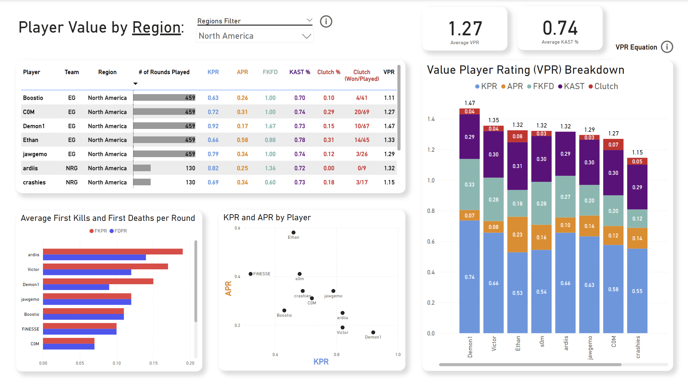

# Valorant Champions 2023 Tournament Player Value Analysis

## Introduction
Analyzing player metric trends based on player performance during the Valorant Champions Tournament 2023 to make informed recommendations on player contract acquisition based on a player value rating.

An Interactive PowerBI dashboard can be found here.

## How the Value Player Rating (VPR) was constructed

**VPR = (KPR * 0.8) + (APR * 0.5) + (Clutch % * 0.25) + (FKFD * 0.2) + (KAST % * 0.4)**

### Metrics Explained

1. **KPR**: Average Kills Per Round
   
2. **APR**: Average Assist Per Round
  
3. **Clutch %**: Clutch Rate Percentage (Won/Played)
   - **Importance**: Measures a player's ability to perform in high-pressure situations, and is representative of a players reliability in the clutch.
   
4. **FKFD**: First Kill First Death Ratio
   - **Importance**: Measures how often a player gets the first kill versus being the first to die in a given round. A high FKFD ratio shows that a player consistently contributes to gaining an early numbers advantage for their team in a given round.
   
5. **KAST %**: Impact Percentage (Kills, Assists, Survived, and Traded Percentage)
   - **Importance**: Measures the percentage of rounds in which a player either got a kill, assist, survived, or was traded. A high KAST % indicates a player's consistency in bringing value to their team in every round.

## Summary of Insights

### Tournament Insights:

- **Player Role Distribution**: **Controllers** dominated the tournament, being the most represented role. This indicates their crucial role in controlling the tempo of the game.
- **Meta Trends**: The meta revolved around **Killjoy** and **Controller** agents, which were pivotal in holding sites and providing team support. Mobility-based agents like **Jett** and **Raze** were frequently picked to counteract this meta, providing aggressive plays and opening opportunities for their teams.
- **Killjoy Dominance**: Despite **Sentinels** being the least represented role, **Killjoy** was the most picked agent, proving her value in the tournament and her effectiveness in an underrepresented role.

### VPR on Role:

- **Top Performers by Role**: **Duelists** generally had the highest VPRs, showcasing their impactful presence in matches through high kill counts and clutch performances. Players like **kez1nit** and **aspas** were standout Duelists. **Initiators** also showed strong VPRs, emphasizing their role in creating opportunities for their teams, with players like **Leo** and **Cloud** leading the way.
- **Role-Specific Insights**: **Sentinels**, while less common, had players like **Demon1** and **SUYGETSU** with high VPRs, indicating standout performances that are critical despite the overall lower representation of the role.
- **Contract Considerations**: When considering contracts, prioritize high VPR players from roles that consistently impact the game, like **Duelists** and **Initiators**, while also recognizing exceptional performances from underrepresented roles like **Sentinels**.

### VPR on Region:

- **Regional Strengths**: Players from regions like **Europe** and **North America** generally had higher VPRs, indicating a higher level of competition and individual performance in these regions. Players like **Demon1** from North America and **Leo** from Europe exemplify this trend.
- **Regional Weaknesses**: Certain regions like **China** showed lower overall VPRs, suggesting a potential gap in competitive experience or performance.
- **Regional Contract Recommendations**: Focus on acquiring top-performing players from strong regions to ensure high-impact signings. Additionally, consider scouting emerging talents from regions with lower VPRs but high potential for growth.

## Questions to Answer
1. [**Who were the most valuable players of the tournament?**](#who-were-the-most-valuable-players-of-the-tournament)
2. [**What were the performance metrics of the most valuable players?**](#what-were-the-performance-metrics-of-the-most-valuable-players)
4. [**Who were the most undervalued players of the tournament?**](#who-were-the-most-undervalued-players-of-the-tournament)
5. [**Which regions have the most potential future contract prospects?**](#which-regions-have-the-most-potential-future-contract-prospects)
6. [**Which players can be recommended as contract prospects?**](#which-players-can-be-recommended-as-contract-prospects)

   
## Who were the most valuable players of the tournament?

## What were the performance metrics of the most valuable players?
The Value Player Rating (VPR) was created based on insights from this [YouTube video](https://www.youtube.com/watch?v=7QCR19qYPgI).

### How was the VPR created
The VPR is a composite metric designed to evaluate a player's overall impact on the game. It incorporates several key performance metrics that indicate how much value a player contributes through their performance.

The formula used for calculating VPR is as follows:

[ VPR = (KPR * 0.8) + (APR * 0.5) + (Clutch % * 0.25) + (FKFD * 0.2) + (KAST % * 0.4) ]

### Explanation of Variables

1. **KPR (Average Kills Per Round)**:
   - **Importance**: High kill rates are essential for securing rounds and maintaining map control. Kills directly influence the outcome of each round by reducing the opposing team's ability to fight back.
   - **Justification**: Weighted at 0.8 to emphasize the direct impact of kills on the game while maintaining a balance with other performance metrics. Kills are crucial for individual player impact but should not overshadow the importance of teamwork and other contributions.

2. **APR (Average Assists Per Round)**:
   - **Importance**: Assists indicate teamwork and the ability to contribute to kills even without landing the final shot. Assists often reflect a player's support role and their contribution to team play.
   - **Justification**: Weighted at 0.4 as assists are important but secondary to kills in terms of individual impact. This weight ensures that assists are valued for their role in team dynamics but are not overly emphasized compared to direct eliminations.

3. **CL_percentage (Clutch Percentage)**:
   - **Importance**: Clutch plays often turn the tide of a round, showcasing a player's ability to perform under pressure.
   - **Justification**: Weighted at 0.25 since clutch moments, while impactful, occur less frequently and should be balanced with consistent performance metrics.

4. **FKFD (First Kill First Death Ratio)**:
   - **Importance**: Securing the first kill in a round provides a significant advantage, while minimizing early deaths reduces the team's risk.
   - **Justification**: Weighted at 0.2 to reflect its importance in gaining early-round advantages without overshadowing other metrics.

5. **KAST_percentage (Kills, Assists, Survived, and Traded Percentage)**:
   - **Importance**: A comprehensive metric indicating overall effectiveness in multiple aspects of play.
   - **Justification**: Weighted at 0.4 as it combines several critical factors of player performance, providing a holistic view of their impact on the game.

## Who were the most undervalued players of the tournament?

## Which regions have the most potential future contract prospects?

## Which players can be recommended as contract prospects?

